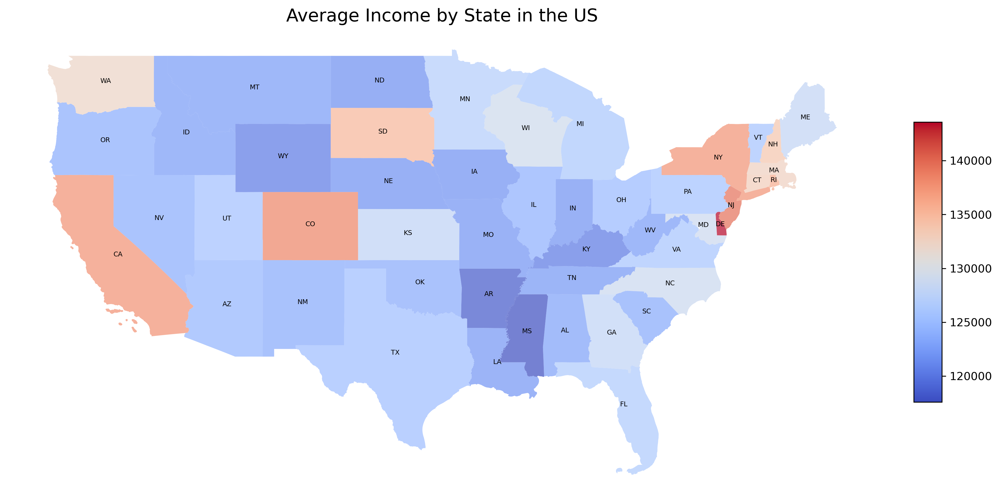
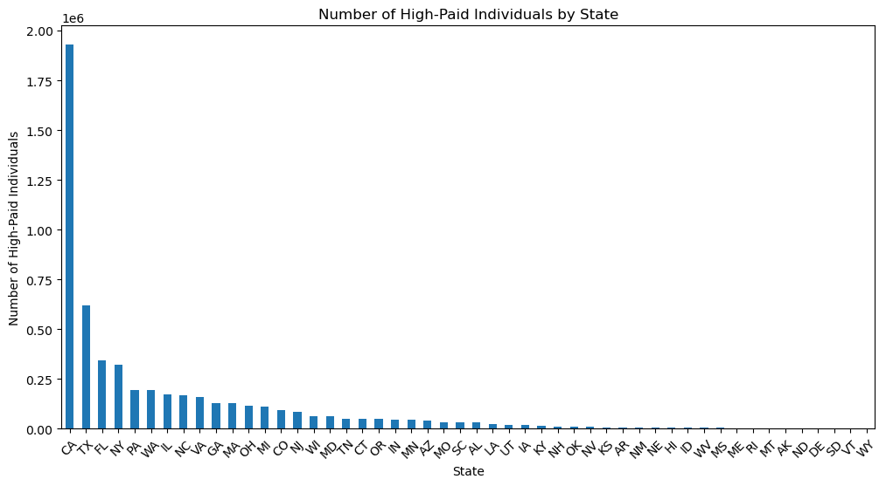
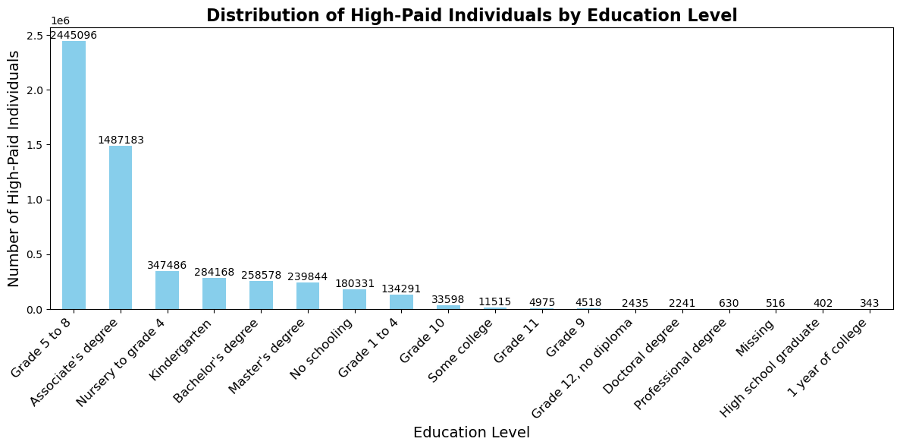
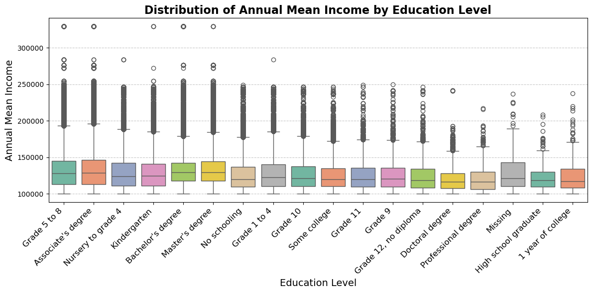
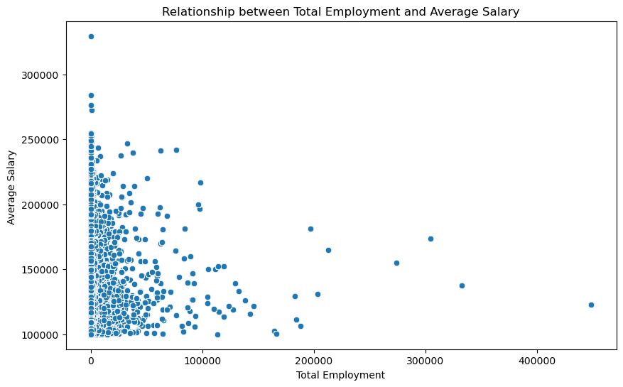
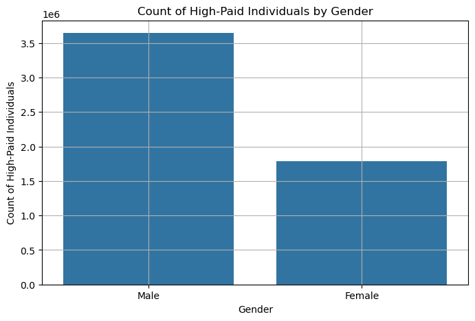
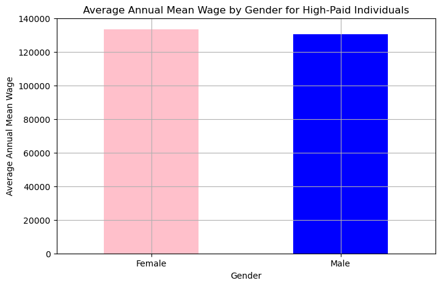
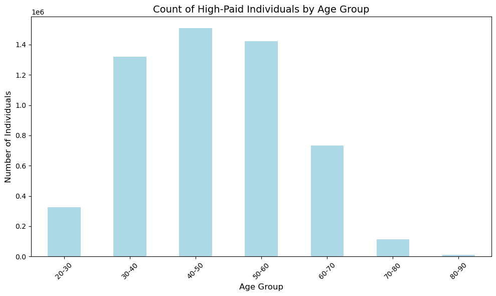

# BLS Data Exploration for Most Profitable Jobs
# Project Overview

This project analyzes the relationship between salary, education, and occupation across U.S. states using data from the Bureau of Labor Statistics (BLS) and the U.S. Census. The goal is to understand how these factors influence job opportunities and income levels in different geographical areas.

# Table of Contents
- [Project Goals](#project-goals)
- [Data Preparation](#data-preparation)
- [Data Analysis](#data-analysis)
- [Conclusions](#conclusions)
- [References](#references)
- [Folder Structure](#folder-structure)
- [Code Demonstration](#code-demonstration)


# Project Goals:
- Identify High-Paying Occupations: Find the top occupations earning $100k+ and categorize them by industry, educational requirements, and experience level. 
- Explore Education and Training Requirements: Investigate the correlation between education level and earnings
- Compare Demographic Trends: Look into how gender, race, or geographic location might influence access to high-paying jobs. 

# Data Preparation:
The data used for this project was downloaded from the Educational Attainment and the Occupational Employment and Wage Statistics (OEWS) data from the U.S. Bureau of Labor Statistics and from the IPUMS USA Census data. Afterwards, we cleaned and merged these datasets to begin our analysis, which focused on key variables like occupation, educational attainment, and wage statistics. 

Since our main goal was figuring out what the highest paid jobs were, we filtered the data to only include jobs that had an average annual income of over $100,000, or an average hourly income over $48.08. We also ensured the data was cleaned and clear of all empty or missing values. The datasets were merged on the occupation code and on the state code. 

# Data Analysis:
After exploring the distributions of educational attainment and wage data, here is the analysis we have gathered after identifying correlations between education levels and wages, as well as trends in high-paying jobs..

## Average Income by State in the U.S. 



### Visualization Highlights:

- Color Intensity: Darker shades on the map represent states with higher average annual wages.
- Clusters of Wealth: States in the Mid-Atlantic and West Coast dominate, showcasing clear contrasts with less urbanized states.

### Key Insights: 

Delaware leading is based on average annual wages per individual (relative concentration of high-paid individuals).

Delaware has the highest concentration of high-paid individuals, based on the annual mean wage data. This distinction may be attributed to its status as a hub for corporate headquarters and financial services.

Other Top States:

- New York: With its dominance in industries such as finance, media, and technology, New York ranks second.
- California: Known for its thriving technology and entertainment sectors, California secures the third position.
- Colorado: Emerging industries like technology, aerospace, and energy significantly contribute to its high rankings.
- New Jersey: Its proximity to New York City, coupled with a robust pharmaceutical and finance sector, makes New Jersey a strong contender. 

> States with urban centers and a strong presence of high-paying industries generally perform better. Coastal states, particularly in the Northeast and West Coast, exhibit a clear advantage over their inland counterparts.

## Number and Percentage of High-Paid Individuals by State



The same grpah was summarized into the pie chart below. States with a national paid individual average below 5% were grouped into "Other" to display the largest percentages across the nation.


### Key Insights: 

These visualizations reflect the absolute numbers of high-paid individuals due to the sheer population size of these states. For example, California has a larger population, resulting in a higher total number of high-income earners, even if the average income is not the highest.

## Top 10 Occupations of High-Paid Individuals 


The same visualization was transformed into a horizontal bar chart below for readability. 


### Key Insights: 

The top occupations indicate a strong representation from the technology sector, emphasizing its role as a high-paying industry. Financial managers' inclusion highlights the importance of financial expertise in driving organizational success. Both IT and financial management roles underscore the premium paid for leadership positions in specialized fields. Categorized as follows:

- Tech Dominance
- Financial Sector Presence
- Management Roles

This visualization reinforces the idea that the highest-paying jobs are often in high-demand, specialized fields like software development and financial management. These sectors require specific skill sets and leadership, which are highly compensated across different regions.

## Distribution of High-Paid Individuals and Annual Mean Income by Education Level 



The distribution of high-paid individuals and annual mean income by education level was also visualized using the boxplot below to show the distribution of the data. 



### Key Insights: 

The high incomes for individuals with "Grade 5 to 8," "Associate Degree," and "Nursing to Grade 4" can be explained by the demand for skilled trades and healthcare roles, which require specialized training rather than a four-year degree. These fields, such as nursing and technical professions, offer high salaries due to expertise, certifications, and the labor market's need for skilled workers

## Correlation Between Annual Salary and Other Variables in the Data


### Key Insights: 

The small correlation (max 0.15) suggests that salary is influenced by many factors in complex ways, not just the numerical features. It could be due to non-linear relationships, diverse salary ranges across industries, or the presence of outliers, making it hard to capture strong linear correlations.

## Relationship between Total Employment and Average Salary



### Key Insights: 

The above scatter shows that there is not a strong relationship between the two fields. As supported by the above correlation heat map, there is not a strong linear relationship between total employment and average salary. 

## Distribution of High-Paid Individuals by Gender



The above visualization displays the count for the highest paid individuals by gender. We then drilled deeper into the data with the below graphic showing the average annual wage by gender. 



### Key Insights: 

The results show that in the count of high-paid individuals by gender, males dominate, which is often reflective of the overall gender disparity in high-paying occupations and leadership roles. This is consistent with many industries where more males are in top-paying positions.

However, in the average annual mean wage by gender, females show a slight dominance, suggesting that within the specific high-paying roles analyzed, women may be earning slightly more on average. This could reflect a few things:

- Differences in Occupations: High-paying jobs for women may be concentrated in fields that offer slightly higher wages.
- Smaller Sample Size for Women: There could be fewer women in the data, but their salaries might skew higher due to fewer women in the job market at the high end.
- Sector Differences: Certain sectors, such as healthcare or education, might have fewer men but offer high-paying opportunities for women, leading to a higher average wage.

> The slight difference in wages might also indicate that the top earners in some fields may be women, even though more men hold high-paying roles in other industries.

## Average Salary for the Top Occupations


This visualization covers the top 10 highest paying occupations and their average salaries. We can see that nurse anesthetics, computer and information research scientists, and architectural and engineering managers are some of the highest paying occupations in the nation. The below visualization drills deeper with a box plot. 


### Key Insights: 

The top occupations and their average salary insight.

## High-Paid Individuals across different Age Groups



### Key Insights: 

The highest paid individuals across different age groups insight.

# Conclusions

Our key conclusions from this analysis are as follows:

- Summary Point 1
- Summary Point 2
- Summary Point 3


# References

- https://www.bls.gov/developers/api_FAQs.htm
- https://www.bls.gov/developers/api_python.htm#python2
- https://www.bls.gov/ooh/occupation-finder.htm
- https://www.bls.gov/oes/tables.htm
- https://data.bls.gov/registrationEngine/
- https://data.bls.gov/oes/#/home
- https://usa.ipums.org/usa/

# Folder Structure

```
├── Data_Resources/
├──── all_data_M_2023.xlsx
├──── usa_00008.csv
├── graphics_images/
├── us_state/
├── bls_data_exploration.ipynb
├── data_source_link.txt
```

# Code Demonstration

Please run the *bls_data_exploration.ipynb* file to run the analysis. The notebook has the file paths matching the folder structure found in the repository. Ensure that the folder structure cloned matches the folder structure above found in the repository.