# BLS Data Exploration for Most Profitable Jobs
# Project Overview

This project analyzes the relationship between salary, education, and occupation across U.S. states using data from the Bureau of Labor Statistics (BLS) and the U.S. Census. The goal is to understand how these factors influence job opportunities and income levels in different geographical areas.

# Table of Contents
- [Code Demonstration Instructions](#code-demonstration-instructions)
- [Project Goals](#project-goals)
- [Data Preparation](#data-preparation)
- [Data Analysis](#data-analysis)
    - [(1) Distribution of Average Income for the highest-paid individuals by State in the U.S.](#1-distribution-of-average-income-for-the-highest-paid-individuals-by-state-in-the-us)
    - [(2) Top 10 Most Common Occupations of High-Paid Individuals ](#2-top-10-most-common-occupations-of-high-paid-individuals)
    - [(3) Distribution of High-Paid Individuals and Annual Mean Income by Education Level](#3-distribution-of-high-paid-individuals-and-annual-mean-income-by-education-level)
    - [(4) Correlation Between Annual Salary and Other Variables in the Data](#4-correlation-between-annual-salary-and-other-variables-in-the-data)
    - [(5) Distribution of High-Paid Individuals by Gender](#5-distribution-of-high-paid-individuals-by-gender)
    - [(6) Average Salary Variance for the Top Occupations](#6-average-salary-variance-for-the-top-occupations)
    - [(7) Distribution of High-Paid Individuals across different Age Groups](#7-distribution-of-high-paid-individuals-across-different-age-groups)
- [Problems Encountered](#problems-encountered)
- [Conclusions](#conclusions-and-key-findings)
- [Future Considerations](#future-considerations)
- [Repository Structure](#repository-structure)
- [References](#references)

# Code Demonstration Instructions

After cloning the repository, before running the code, ensure that your folder and file structure **at minimum** looks like the following:

```
├── Data_Resources/
├──── bls_data.xlsx
├──── census_data.csv
├── graphics_images/
├── us_state/
├──── us_state.cpg
├──── us_state.dbf
├──── us_state.prj
├──── us_state.shp
├──── us_state.shp.ea.iso.xml
├──── us_state.shp.iso.xml
├──── us_state.shx
├── bls_data_exploration.ipynb
```

You will need the **"Data_Resources/"** folder to exactly match to input the data, a directory called **"graphics_images/"** to store the images and charts produced, the **"us_state/"** folder to exactly match to build the geographic heatmaps, and the **"bls_data_exploration.ipynb"** notebook file to run the analysis. The raw datasets must be inside the **"Data_Resources/** folder, and the U.S. state shape data (all data within the us_state folder) must also be placed in the **us_state/** folder prior to running the code. Please run the **"bls_data_exploration.ipynb"** file to run the analysis. The notebook has the file paths matching the folder structure found in the repository.  

Please note you must have the following python libraries installed before running this code:

1. pandas 
    - Needed for general data frame management
2. numpy
    - Needed for calculating statistics
3. seaborn
    - Needed for statistical data visualization
4. matplotlib.pyplot
    - Needed for plotting the data
5. geopandas
    - Needed for creating the geographic heat maps
6. datetime
    - Needed for calculating and setting datetimes inside the data


# Project Goals:
- Identify High-Paying Occupations: Find the top occupations earning $100k+ and categorize them by industry, educational requirements, and experience level. 
- Explore Education and Training Requirements: Investigate the correlation between education level and earnings
- Compare Demographic Trends: Look into how gender, race, or geographic location might influence access to high-paying jobs. 

# Data Preparation:
The data used for this project was downloaded from the Educational Attainment and the Occupational Employment and Wage Statistics (OEWS) data from the U.S. Bureau of Labor Statistics and from the IPUMS USA Census data. Afterwards, we cleaned and merged these datasets to begin our analysis, which focused on key variables like occupation, educational attainment, and wage statistics. 

Since our main goal was figuring out what the highest paid jobs were, we filtered the data to only include jobs that had an average annual income of over $100,000, or an average hourly income over $48.08. We also ensured the data was cleaned and clear of all empty or missing values. The datasets were merged on the occupation code and on the state code. 

# Data Analysis:
After exploring the distributions of educational attainment and wage data, here is the analysis we have gathered after identifying correlations between education levels and wages, as well as trends in high-paying jobs. We will be attempting to answer the following questions through our analysis:

1. What is the distribution of high-paid individuals across different states?
2. What are the most common occupations among high-paid individuals?
3. What is the relationship between education level and the number of high-paid individuals?
4. What is the correlation between salary (A_MEAN) and other numerical features?
5. What is the distribution of high-paid individuals by gender?
6. How does the average salary vary across different occupation?
7. How is the distribution of high-paid individuals across different age groups?

## (1) Distribution of Average Income for the highest-paid individuals by State in the U.S. 
## What is the distribution of high-paid individuals across different states?

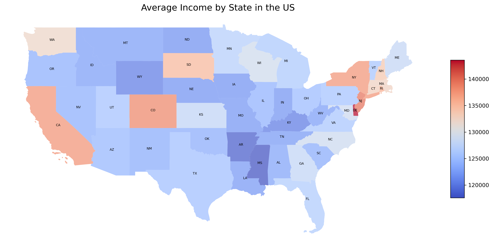

- **Fig 1.1: Average Income by State in the U.S. Heatmap**

### Visualization Highlights:

- Color Intensity: Darker shades on the map represent states with higher average annual wages.
- Clusters of Wealth: States in the Mid-Atlantic and West Coast dominate, showcasing clear contrasts with less urbanized states.

### Key Insights: 

Delaware leading is based on average annual wages per individual (relative concentration of high-paid individuals).

Delaware has the highest concentration of high-paid individuals, based on the annual mean wage data. This distinction may be attributed to its status as a hub for corporate headquarters and financial services.

Other Top States:

- New York: With its dominance in industries such as finance, media, and technology, New York ranks second.
- California: Known for its thriving technology and entertainment sectors, California secures the third position.
- Colorado: Emerging industries like technology, aerospace, and energy significantly contribute to its high rankings.
- New Jersey: Its proximity to New York City, coupled with a robust pharmaceutical and finance sector, makes New Jersey a strong contender. 

> States with urban centers and a strong presence of high-paying industries generally perform better. Coastal states, particularly in the Northeast and West Coast, exhibit a clear advantage over their inland counterparts.

## Distribution of Highest-Paid Individuals by State

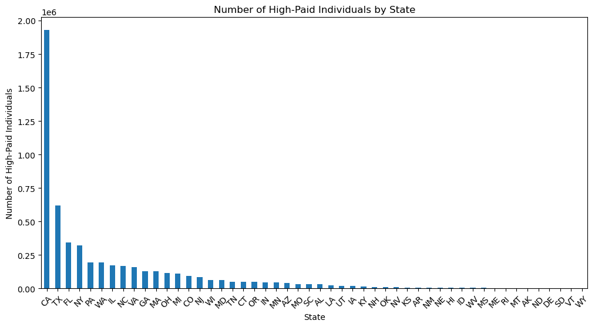

- **Fig 1.2: Bar plot showing the number of high-paid individuals by state**

The same grpah was summarized into the pie chart below. States with a national paid individual average below 5% were grouped into "Other" to display the largest percentages across the nation.

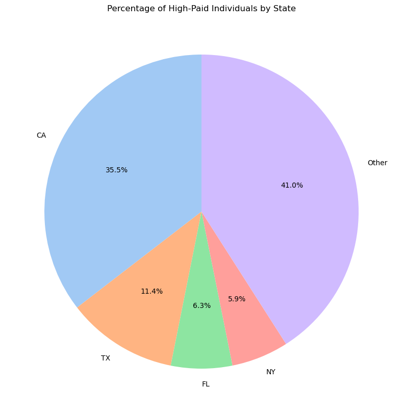

- **Fig 1.3: Pie chart showing the percentage of high-paid individuals by state**

### Key Insights: 

These visualizations reflect the absolute numbers of high-paid individuals due to the sheer population size of these states. For example, California has a larger population, resulting in a higher total number of high-income earners, even if the average income is not the highest.

## (2) Top 10 Most Common Occupations of High-Paid Individuals 
## What are the most common occupations among high-paid individuals?

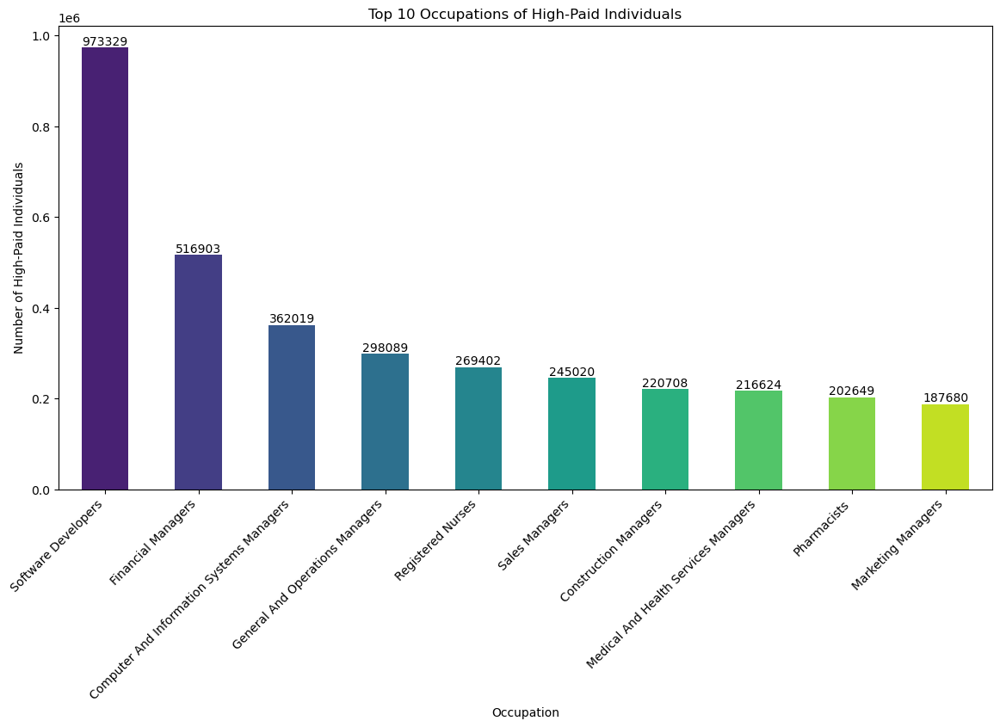

- **Fig 2.1: Bar plot showing the top 10 occupations for high-paid individuals**

### Key Insights: 

We have visualized the top 10 occupations of the highest paid individuals. Of note, the technology industry was the most represented with Software Developrs and Computer and Information Systems Managers. Financial Managers also made up a large portion of the top 10 occupations. This matches how some of the highest paying jobs found on job sites are usually located in the tech industry. The same visualization was transformed into a horizontal bar chart below for readability. 

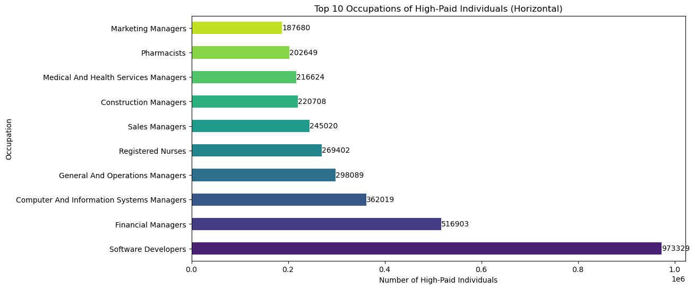

- **Fig 2.2: Horizontal Bar plot showing the top 10 occupations for high-paid individuals**

### Key Insights: 

The top occupations indicate a strong representation from the technology sector, emphasizing its role as a high-paying industry. Financial managers' inclusion highlights the importance of financial expertise in driving organizational success. Both IT and financial management roles underscore the premium paid for leadership positions in specialized fields. Categorized as follows:

- Tech Dominance
- Financial Sector Presence
- Management Roles

This visualization reinforces the idea that the highest-paying jobs are often in high-demand, specialized fields like software development and financial management. These sectors require specific skill sets and leadership, which are highly compensated across different regions.

## (3) Distribution of High-Paid Individuals and Annual Mean Income by Education Level 
## What is the relationship between education level and the number of high-paid individuals?

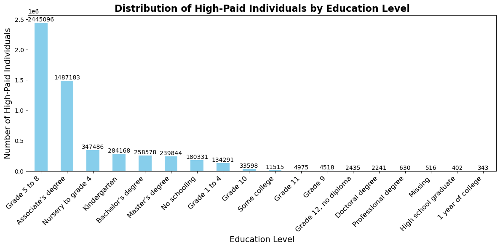

- **Fig 3.1: Bar plot showing the number of high-paid individuals by education level**

### Key Insights: 

The distribution of high-paid individuals and annual mean income by education level visualized above in a bar chart. We can see that the the individuals that had the highest income were not necessarily college graduates with elaborate degrees, instead placing an emphasis on certifications and skilled trades. This was also visualized using the boxplot below to show the distribution of the averages of the data. 

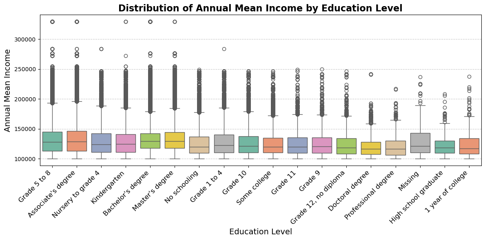

- **Fig 3.2: Box plot showing the distribution of salaries by education level**

### Key Insights: 

The high incomes for individuals with "Grade 5 to 8," "Associate Degree," and "Nursing to Grade 4" can be explained by the demand for skilled trades and healthcare roles, which require specialized training rather than a four-year degree. These fields, such as nursing and technical professions, offer high salaries due to expertise, certifications, and the labor market's need for skilled workers

## (4) Correlation Between Annual Salary and Other Variables in the Data
## What is the correlation between salary (A_MEAN) and other numerical features?

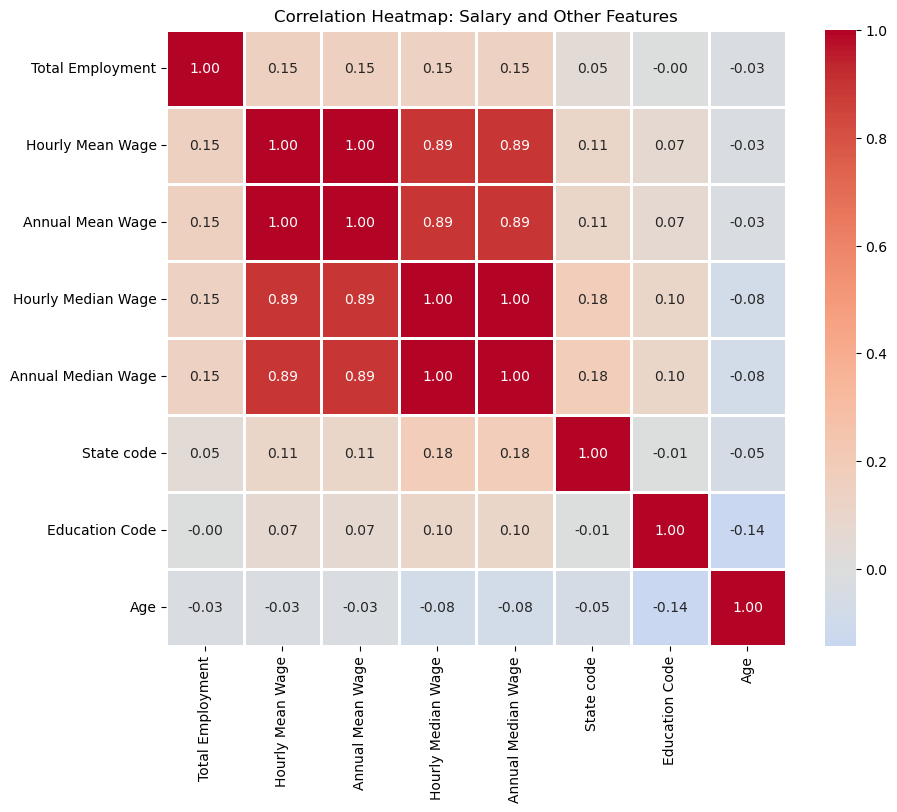

- **Fig 4.1: Heatmap showing the correlation matrix of numerical features**

### Key Insights: 

The small correlation (max 0.15) suggests that salary is influenced by many factors in complex ways, not just the numerical features. It could be due to non-linear relationships, diverse salary ranges across industries, or the presence of outliers, making it hard to capture strong linear correlations.

## Relationship between Total Employment and Average Salary

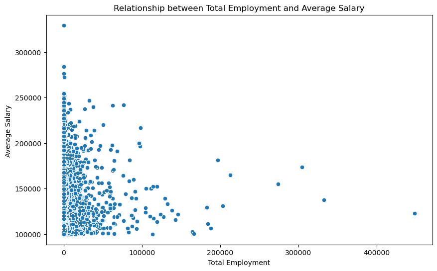

- **Fig 4.2: Scatter plot showing the relationship between Average Salary (A_MEAN) and Total Employment (TOT_EMP)**

### Key Insights: 

The above scatter shows that there is not a strong relationship between the two fields. As supported by the above correlation heat map, there is not a strong linear relationship between total employment and average salary that we could analyze from the data we collected. 

## (5) Distribution of High-Paid Individuals by Gender
## What is the distribution of high-paid individuals by gender?

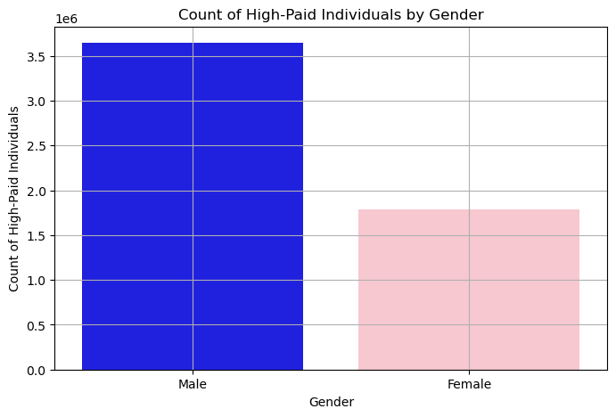

- **Fig 5.1: Count of High-Paid Individuals by Gender**

### Key Insights: 

The above visualization displays the count for the highest paid individuals by gender. This showed that there are collectively more men that women, as their total count of salaries is higher. This could be attributed to how it is more likely that women, over men, are stay at home parents and do not work. The results show that in the count of high-paid individuals by gender, males dominate, which is often reflective of the overall gender disparity in high-paying occupations and leadership roles. This is consistent with many industries where more males are in top-paying positions. 

We then drilled deeper into the data with the below graphic showing the average annual wage by gender. 

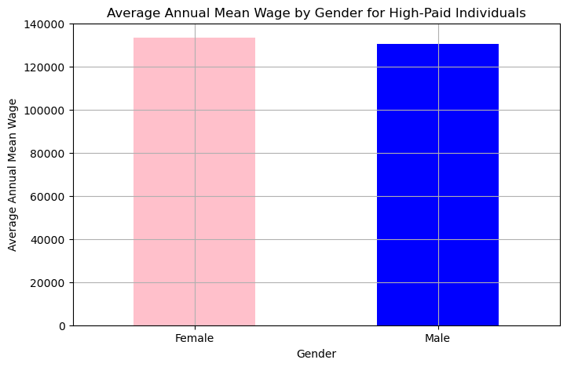

- **Fig 5.2: Average Annual Mean Wage by Gender**

### Key Insights: 

However, in the average annual mean wage by gender, females show a slight dominance, suggesting that within the specific high-paying roles analyzed, women may be earning slightly more on average. This could reflect a few things:

- **Differences in Occupations:** High-paying jobs for women may be concentrated in fields that offer slightly higher wages.
- **Smaller Sample Size for Women:** There could be fewer women in the data, but their salaries might skew higher due to fewer women in the job market at the high end.
- **Sector Differences:** Certain sectors, such as healthcare or education, might have fewer men but offer high-paying opportunities for women, leading to a higher average wage.

> The slight difference in wages might also indicate that the top earners in some fields may be women, even though more men hold high-paying roles in other industries.

## (6) Average Salary Variance for the Top Occupations
## How does the average salary vary across different occupation?

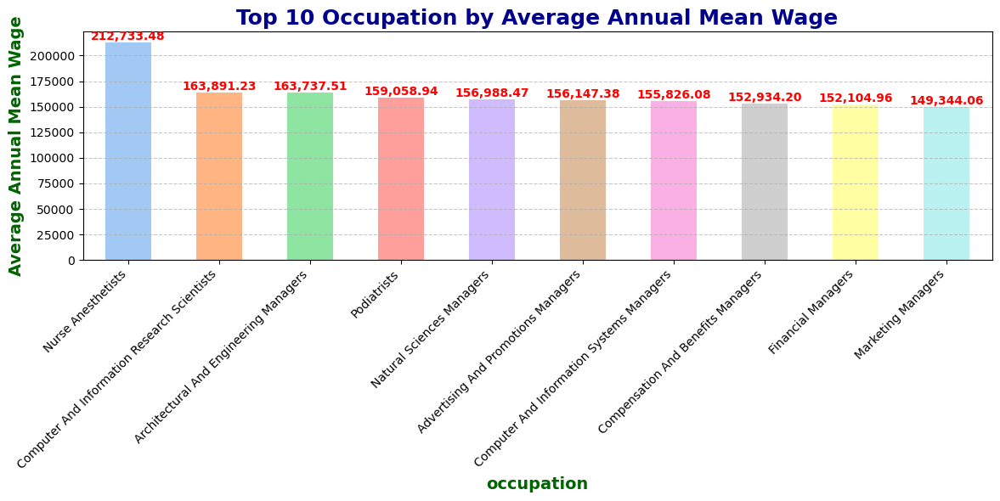

- **Fig 6.1: Bar chart depicting the top 10 occupations and their average annual mean wage**

### Key Insights: 

This visualization covers the top 10 highest paying occupations and their average salaries. We can see that nurse anesthetics, computer and information research scientists, and architectural and engineering managers are some of the highest paying occupations in the nation. This matches the usual trend of tech and medical jobs having some of the highest salaries. The below visualization drills deeper with a box plot.

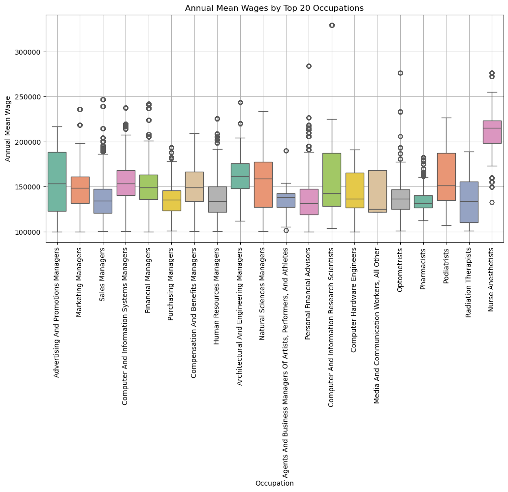

- **Fig 6.2: Box plot showing the distribution of annual mean wages for the top 20 occupations**

### Key Insights: 

The top occupations mentioned above, **[nurse anesthetics, computer and information research scientists, and architectural and engineering managers]**, are shown to have not only the highest annual wages but also the highest ranges of salaries amongst other professions. Even though Computer and Information Research Scientists have a higher max salary, their average salary is much lower than Nurse Anesthetics. So on average, Nurse Anesthetics will make more than Computer and Information Research Scientists, even if the latter profession has higher peaks. 

## (7) Distribution of High-Paid Individuals across different Age Groups
## How is the distribution of high-paid individuals across different age groups?

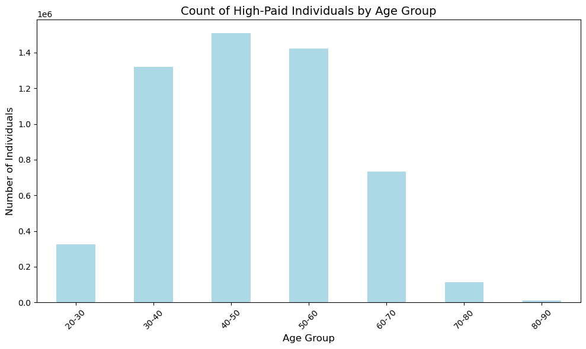

- **Fig 7.1: Bar chart showing the count of high-paid individuals by age**

### Key Insights: 

The highest paid individuals across different age groups insight. We can see that those later in their career in the 40-50 year range is the highest demographic of people earning the most in the nation. This is followed closely by the 50-60 year range and the 30-40 year range. As a result, people who are in senior/leadership positions are making the most amount of money on average, as they have finally built their careers and have the most experience in their industries. Those closer to retirement age and those starting out obviously would not make as much. 

# Problems Encountered

While performing this exploratory analysis, we encountered a few problems when analyzing the data. One issue was that differentiating between national and state-level data in BLS required filtering to focus on state-specific insights. Some of the data had been aggregated across a region for multiple states and so had to be flattened for state specific data. 


Mapping education as a factor was challenging due to incompatible or missing data fields. The education field was not as detailed or as clear as it should have been from the census data. Therefore, most of the interpretations we made required a bit more work and creativity. 

Aligning education data with geographic maps needed extra processing for accuracy. This simply wasn't possible in the limited time we had for the project. This could be investigated further in the future. 

Handling data inconsistencies and ensuring proper merges across datasets required careful validation. Most of the data was listed under specific codes that had to be translated into more readable data. As such, a lot of care was done to validate and merge the datasets together. 


# Conclusions and Key Findings

Our key conclusions from this analysis are as follows:

- **Geographic Trends:**
    - Delaware leads with the highest concentration of high-paid individuals, driven by its corporate and financial sectors.
    - States like California, New York, and Texas follow, supported by industries such as technology, finance, and entertainment.
- **Occupational Insights:**
    - Common high-paying occupations include Software Developers, Financial Managers, and Computer and Information Systems Managers.
    - These roles reflect the growing importance of technology and leadership in driving economic growth.
- **Education and Salary:**
    - Surprisingly, individuals with education levels between Grade 5–8 showed notable representation in high-income brackets, likely influenced by outliers or specific job contexts.
    - Overall, higher education correlated with increased earning potential, though not uniformly across all sectors.
- **Gender Dynamics:**
    - Males dominate in terms of sheer numbers of high-paid individuals.
    - However, females exhibited slightly higher average annual wages in some instances, indicating possible progress in wage equality within certain fields.
- **Age Distribution:**
    - The majority of high-paid individuals fall between 35–54 years, aligning with peak career growth and experience.
- **Weak Correlation with Features:**
    - Most numerical features, including employment size and location quotient, showed weak correlation with salary, suggesting more complex factors influence high incomes.


# Future Considerations

If more time was available, these are a few of the questions and research ideas we could have embarked on:

- Address disparities in income across gender and regions.
- Leverage machine learning to predict high-income trends and explore deeper relationships in the data.
- Create interactive tools for policymakers to evaluate workforce development and education initiatives.
- Explore industry-specific wage trends.
- Analyze income shifts over time.
- What drives gender income disparities despite similar education levels?
- How do urban vs. rural incomes differ within states?

Next steps for this project would involve using machine learning for income prediction and for pattern discovery amongst the BLS and census data. Another new development could be a interactive dashboard for better data exploration. These would help enhance the analysis further on the datasets.


# Repository Structure

```
├── Data_Resources/
├──── bls_data.xlsx
├──── census_data.csv
├── graphics_images/
├──── fig1.1_avg_income_state_heatmap.png
├──── fig1.2_num_paid_individuals_barchart.png
├──── fig1.3_percentage_high_paid_state_piechart.png
├──── fig2.1_top10_occ_state_barchart_vertical.png
├──── fig2.2_top10_occ_state_barchart_horizontal.png
├──── fig3.1_distr_educ_high_paid_barchart.png
├──── fig3.2_distr_educ_annual_mean_income_boxplot.png
├──── fig4.1_correlation_heatmap.png
├──── fig4.2_total_employment_avg_salary_scatter.png
├──── fig5.1_high_paid_gender_barchart.png
├──── fig5.2_avg_annual_mean_wage_gender_barchart.png
├──── fig6.1_top10_occ_annual_mean_wage_barchart.png
├──── fig6.2_top20_occ_annual_mean_wage_boxplot.png
├──── fig7.1_count_high_paid_age_group_barchart.png
├── us_state/
├──── us_state.cpg
├──── us_state.dbf
├──── us_state.prj
├──── us_state.shp
├──── us_state.shp.ea.iso.xml
├──── us_state.shp.iso.xml
├──── us_state.shx
├── bls_data_exploration.ipynb
├── README.md
```


# References

- https://www.bls.gov/developers/api_FAQs.htm
- https://www.bls.gov/developers/api_python.htm#python2
- https://www.bls.gov/ooh/occupation-finder.htm
- https://www.bls.gov/oes/tables.htm
- https://data.bls.gov/registrationEngine/
- https://data.bls.gov/oes/#/home
- https://usa.ipums.org/usa/

## Project completed by:
- SAMI CHOWDHURY
- MARWA BENSALEM
- ROBERT FERRARI
- MILEN KING
